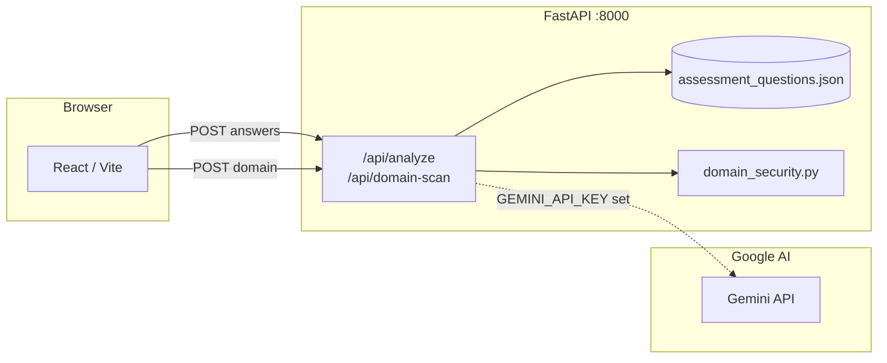

# hackmisso-tech

**ClearRisk** — HackMISSO-style cyber safety questionnaire (JSON-driven questions + scoring bands), FastAPI analysis, **Gemini**-powered recommendations when configured, passive **domain / email-auth / HTTPS** checks, and a React (Vite) UI.

## System architecture



**Data flow:** User answers → `POST /api/analyze` → sum weighted risk from JSON → posture % → gaps with risk points → **Gemini** returns 3 JSON-string recommendations (or built-in fallback) → UI shows source badge and any provider error.

## Alignment with HackMISSO technical rubric

Criteria mirror the [HackMISSO Technical Grading Rubric](https://docs.google.com/spreadsheets/d/1gMAwGm-o3R9QL8m_Ydz3uj7DpS0D4zuaG6AcfUz4K38/edit?gid=0#gid=0):

| Criterion (sheet) | How this repo addresses it |
|-------------------|----------------------------|
| **System architecture & technical design** | Diagram above; split `main.py` (API + scoring + AI), `domain_security.py` (DNS/email/TLS), `assessment_questions.json` (single source of truth), `frontend/` SPA. |
| **Questionnaire, scoring matrix, problem fit** | 20 categorized questions (A–D), NIST/CIS/ISO tags in JSON, weighted risk sum, bands (Low → Critical) with messages. |
| **AI recommendation agent** | Gemini (`gemini-2.5-flash` default) with JSON output mode + parse fallback; gaps drive the prompt; **built-in fallback** if the key is missing or the call fails; UI shows **Gemini** vs **Built-in** and surfaces `ai_provider_error` when the key was set but Gemini failed. |
| **UI/UX** | Guided questionnaire, review step, report dashboard, domain scan results, import/export PDF + JSON. |

*Presentation* is outside the repo; use this README + live demo for judges.

## Repository layout

| Path | Description |
|------|-------------|
| `main.py` | FastAPI app (`/api/analyze`, `/api/domain-scan`, `/api/ai-status`) |
| `domain_security.py` | DNS / SPF / DMARC / HTTPS / TLS helpers |
| `assessment_questions.json` | Question text, categories, options, and risk weights |
| `scripts/verify_gemini.py` | **Run this** to confirm your API key and model work |
| `requirements.txt` | Python dependencies |
| `frontend/` | React + Vite UI |
| `stitch_clearrisk_assessment_view/` | Additional Stitch / design exports |

## Prerequisites

- Python 3.11+ recommended  
- Node.js 18+ and npm  

## Backend

```bash
python -m venv .venv
.venv\Scripts\activate   # Windows
# source .venv/bin/activate   # macOS / Linux

pip install -r requirements.txt
```

### Gemini (AI recommendations)

1. Copy `.env.example` to **`.env`** next to `main.py`.
2. Paste a valid **`GEMINI_API_KEY`** from [Google AI Studio](https://aistudio.google.com/apikey) (keys are usually ~39 characters).
3. Optional: `GEMINI_MODEL=gemini-2.5-flash` (default in code).

`main.py` loads `.env` on startup via **python-dotenv**. Restart **uvicorn** after any `.env` change.

**Verify before demo:**

```bash
python scripts/verify_gemini.py
```

If this prints `OK`, Gemini is working. If it prints `FAIL`, fix the key or model name until it passes.

**Check configuration without exposing the key:**

```bash
curl http://127.0.0.1:8000/api/ai-status
```

Never commit API keys. Revoke any key that was exposed.

Run the API:

```bash
uvicorn main:app --reload --port 8000
```

## API

- `POST /api/analyze` — JSON body: one answer per question id (`q1`…`q20`), values `A` | `B` | `C` | `D`.
- `POST /api/domain-scan` — JSON body: `{ "domain": "example.com" }`.
- `GET /api/ai-status` — whether a Gemini key is loaded (length only, not the secret).
- Analyze response includes `recommendation_source` (`gemini` | `fallback`) and `ai_provider_error` when the key was set but the model call failed.

## Frontend

```bash
npm run install:all
# or: cd frontend && npm install

npm run dev
```

Opens the Vite dev server (default port `5173`) with `/api` proxied to `http://127.0.0.1:8000`. Start the backend first so analysis and domain scan succeed.

Production build:

```bash
npm run build
```

## License

See repository owner for licensing.
