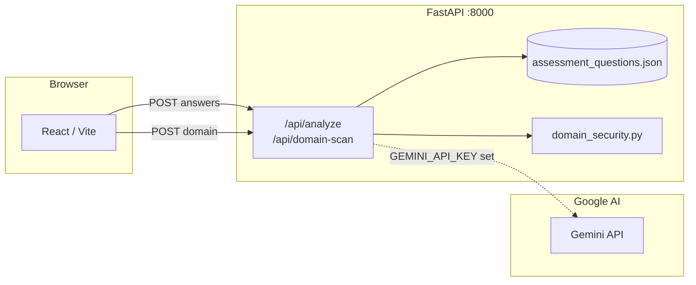

# hackmisso-tech

**ClearRisk** — HackMISSO-style cyber safety questionnaire (JSON-driven questions + scoring bands), FastAPI analysis, **Gemini**-powered recommendations when configured, passive **domain / email-auth / HTTPS** checks, and a React (Vite) UI.

## System architecture



**Data flow:** User answers → `POST /api/analyze` → sum weighted risk from JSON → posture % → gaps with risk points → **Gemini** returns 3 JSON-string recommendations (or built-in fallback) → UI shows source badge and any provider error.

## Alignment with HackMISSO technical rubric

Criteria mirror the [HackMISSO Technical Grading Rubric](https://docs.google.com/spreadsheets/d/1gMAwGm-o3R9QL8m_Ydz3uj7DpS0D4zuaG6AcfUz4K38/edit?gid=0#gid=0):

| Criterion (sheet) | How this repo addresses it |
|-------------------|----------------------------|
| **System architecture & technical design** | Diagram above; split `main.py` (API + scoring + AI), `domain_security.py` (DNS/email/TLS), `assessment_questions.json` (single source of truth), `frontend/` SPA. |
| **Questionnaire, scoring matrix, problem fit** | 20 categorized questions (A–D), NIST/CIS/ISO tags in JSON, weighted risk sum, bands (Low → Critical) with messages. |
| **AI recommendation agent** | Gemini (`gemini-2.5-flash` default) with JSON output mode + parse fallback; gaps drive the prompt; **built-in fallback** if the key is missing or the call fails; UI shows **Gemini** vs **Built-in** and surfaces `ai_provider_error` when the key was set but Gemini failed. |
| **UI/UX** | Guided questionnaire, review step, report dashboard, domain scan results, import/export PDF + JSON. |

*Presentation* is outside the repo; use this README + live demo for judges.

## Repository layout

| Path | Description |
|------|-------------|
| `main.py` | FastAPI app (`/api/analyze`, `/api/domain-scan`, `/api/ai-status`) |
| `domain_security.py` | DNS / SPF / DMARC / HTTPS / TLS helpers |
| `assessment_questions.json` | Question text, categories, options, and risk weights |
| `scripts/verify_gemini.py` | **Run this** to confirm your API key and model work |
| `requirements.txt` | Python dependencies |
| `frontend/` | React + Vite UI |
| `stitch_clearrisk_assessment_view/` | Additional Stitch / design exports |

## Prerequisites

- Python 3.11+ recommended  
- Node.js 18+ and npm  

## Backend

```bash
python -m venv .venv
.venv\Scripts\activate   # Windows
# source .venv/bin/activate   # macOS / Linux

pip install -r requirements.txt
```

### Gemini (AI recommendations)

1. Copy `.env.example` to **`.env`** next to `main.py`.
2. Paste a valid **`GEMINI_API_KEY`** from [Google AI Studio](https://aistudio.google.com/apikey) (keys are usually ~39 characters).
3. Optional: `GEMINI_MODEL=gemini-2.5-flash` (default in code).

`main.py` loads `.env` on startup via **python-dotenv** (`override=True` so your project `.env` wins over an empty `GEMINI_API_KEY` in Windows User environment variables). Restart **uvicorn** after any `.env` or code change.

**Verify before demo:**

```bash
python scripts/verify_gemini.py
```

If this prints `OK`, Gemini is working. If it prints `FAIL`, fix the key or model name until it passes.

**Check configuration without exposing the key:**

```bash
curl http://127.0.0.1:8000/api/ai-status
```

Never commit API keys. Revoke any key that was exposed.

Run the API:

```bash
uvicorn main:app --reload --port 8000
```

## API

- `POST /api/analyze` — JSON body: one answer per question id (`q1`…`q20`), values `A` | `B` | `C` | `D`.
- `POST /api/domain-scan` — JSON body: `{ "domain": "example.com" }`.
- `GET /api/ai-status` — whether a Gemini key is loaded (length only, not the secret).
- Analyze response includes `recommendation_source` (`gemini` | `fallback`) and `ai_provider_error` when the key was set but the model call failed.

## Frontend

```bash
npm run install:all
# or: cd frontend && npm install

npm run dev
```

Opens the Vite dev server (default port `5173`) with `/api` proxied to `http://127.0.0.1:8000`. Start the backend first so analysis and domain scan succeed.

Production build:

```bash
npm run build
```

## Deploying the UI on Vercel ([fork](https://github.com/zain-syed01/hackmisso-tech))

Vercel hosts the **static React app** only. **FastAPI** (`main.py`) must run somewhere else (Railway, Render, Fly.io, your VPS, etc.) with `GEMINI_API_KEY` and optional `CORS_ALLOW_ORIGINS` set there.

1. **Import** your GitHub repo in [Vercel](https://vercel.com/new).
2. **Root Directory:** set to `frontend` (Framework Preset: Vite).
3. **Project name:** you can name the project **ClearRisk** in Vercel. The default URL will be **lowercase**, e.g. `clearrisk.vercel.app` or `clearrisk-<hash>.vercel.app` if that name is taken. For a custom domain (e.g. `app.clearrisk.com`), add it under Project → Settings → Domains.
4. **Environment variables** (Vercel → Settings → Environment Variables), for Production (and Preview if you want):
   - `VITE_API_BASE` = your public API origin with **no** path, e.g. `https://your-api.railway.app`
5. On the **API server**, set `CORS_ALLOW_ORIGINS` to your Vercel site origin(s), comma-separated, e.g. `https://clearrisk.vercel.app` (same URL users open in the browser, `https`, no trailing slash).

`frontend/vercel.json` adds SPA rewrites so refreshes keep working.

### API on Render

1. [Dashboard](https://dashboard.render.com) → **New +** → **Web Service** → connect the same GitHub repo as Vercel (repo **root** is the API; do **not** use `frontend` as root here).
2. **Runtime:** Python. **Build command:** `pip install -r requirements.txt`. **Start command:** `uvicorn main:app --host 0.0.0.0 --port $PORT`
3. **Environment** (Render → your service → **Environment**):
   - `GEMINI_API_KEY` — your Google AI key (optional; without it, recommendations use the built-in fallback).
   - `CORS_ALLOW_ORIGINS` — your Vercel site URL(s), comma-separated, e.g. `https://clearrisk.vercel.app` (exactly what appears in the browser, `https`, no trailing slash).
4. After the first deploy, copy the service URL (e.g. `https://clearrisk-api.onrender.com`) and set **`VITE_API_BASE`** on Vercel to that value (no `/api` suffix).

Free web services **spin down** after idle; the first request after sleep can take ~30–60s.

**If “Run analysis” shows HTTP 404 / NOT_FOUND:** the UI is calling `/api/...` on Vercel, which has no API. Set **`VITE_API_BASE`** on Vercel to your Render URL (see above), **Redeploy** the Vercel project, and set **`CORS_ALLOW_ORIGINS`** on Render to `https://hackmisso-tech.vercel.app` (or your actual Vercel URL).

## License

See repository owner for licensing.
